# 🍔 FoodDrop - Complete Food Delivery Solution


A premium Food Delivery application built with **Flutter**. This project demonstrates a transition from GetX to **Bloc (Cubit)** to implement a more scalable, testable, and organized **Clean Architecture**.

---

## 📱 App Screenshots

### 🔐 Authentication & Onboarding
| Splash Screen | Welcome/Login | Register |
|:---:|:---:|:---:|
| 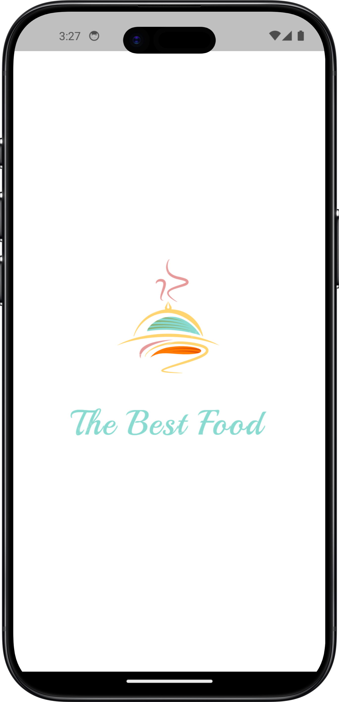 | 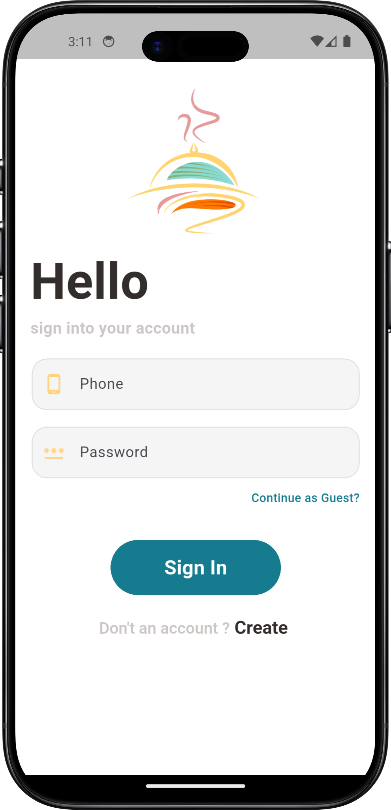 | 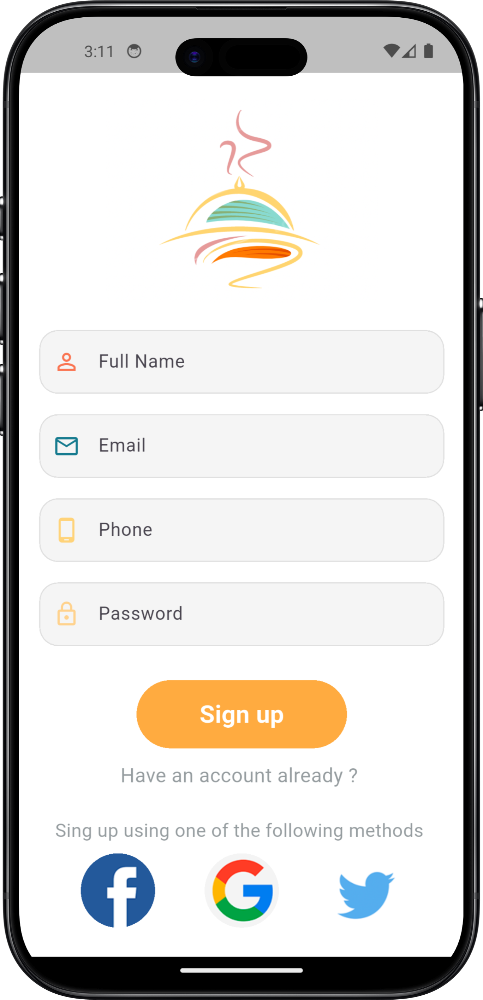 |

### 🏠 Discovery & Ordering
| Home Screen | Food Recommened | Food Details |
|:---:|:---:|:---:|
| 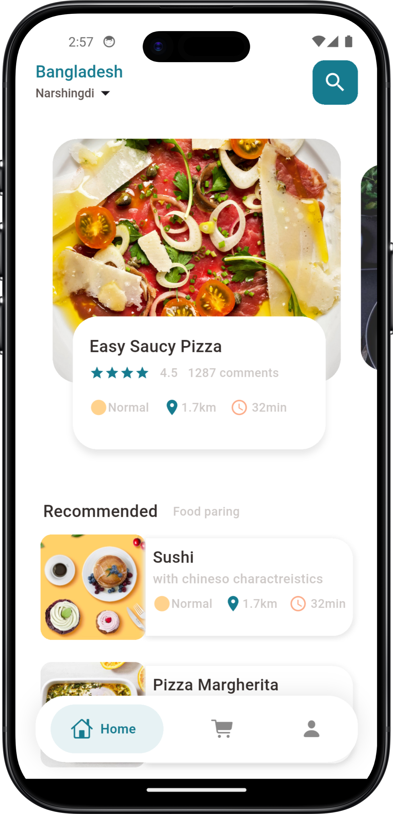 | 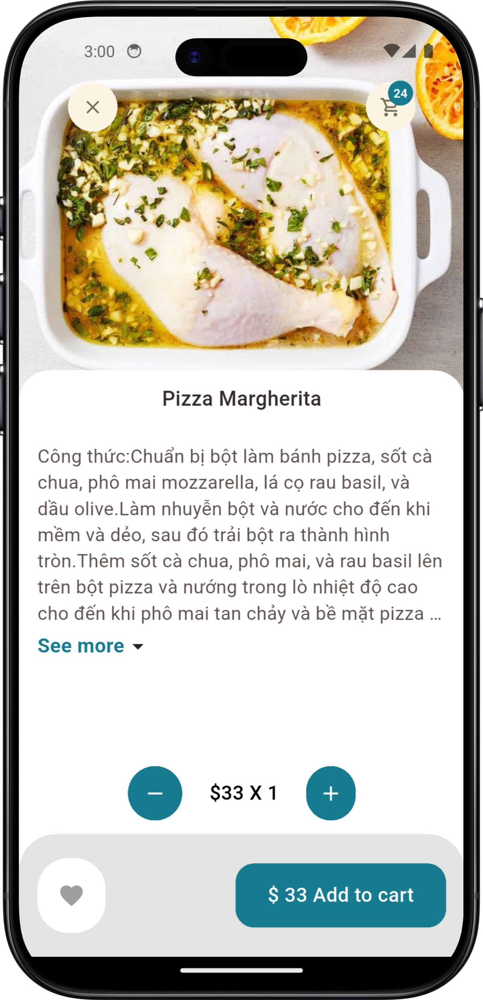 |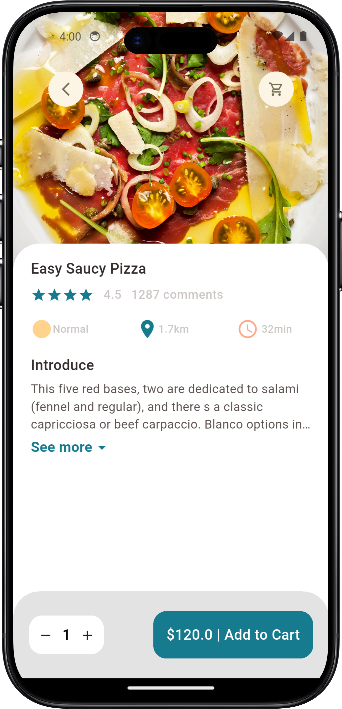 |

### 🛒 Cart & User Profile
| My Cart | Cart History |  User Profile | Image Picker (Camera) |
|:---:|:---:|:---:|:---:|
| 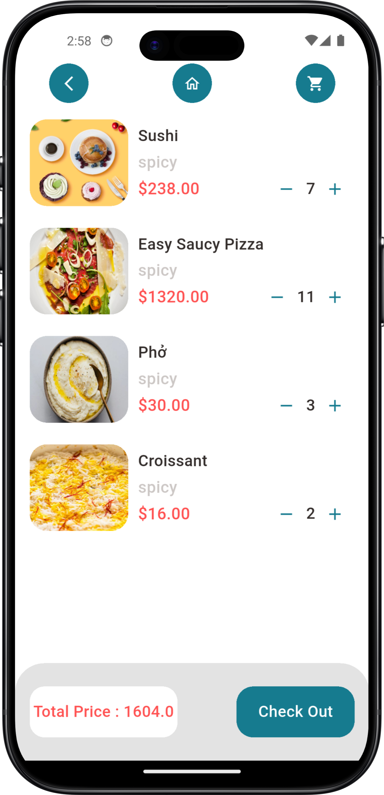 | 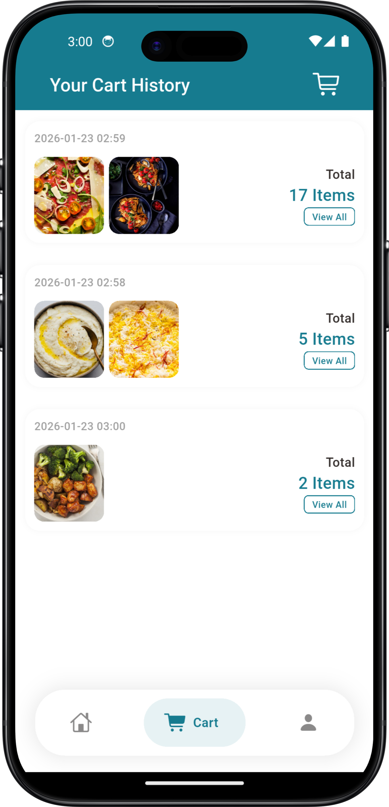 | 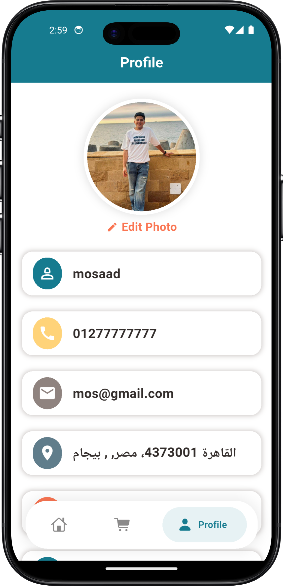 |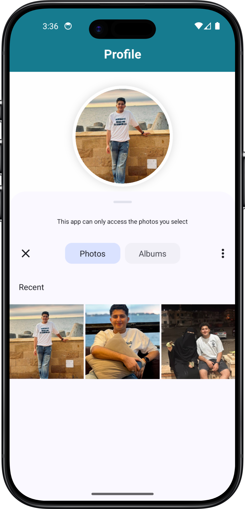 |

### 📍 Location & Maps
| Address Selection |
|:---:|
| 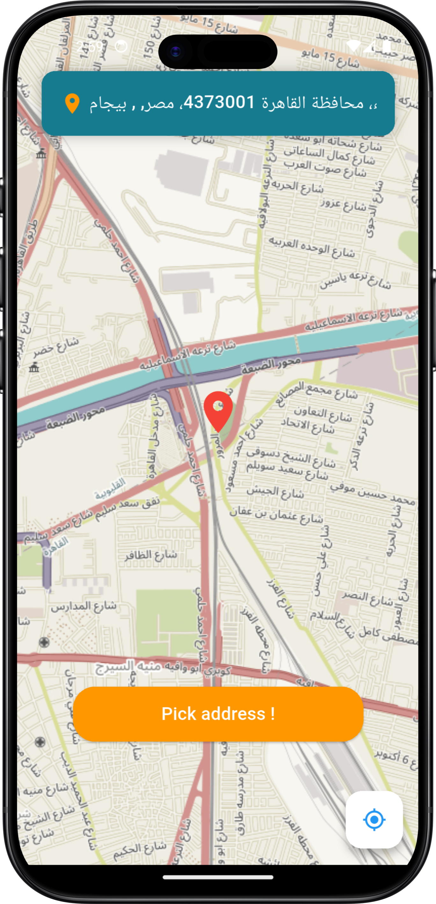 | 


---

## 🏗 Architecture Overview
The project is strictly organized following **Clean Architecture** principles to ensure a professional-grade codebase:


- **Domain Layer:** Business logic, Entities, and Repository interfaces.
- **Data Layer:** Repository implementations, Data Sources (Remote/Local), and Models.
- **Presentation Layer:** UI Components, Themes, and State Management (Cubit).

---

## 🛠 Tech Stack
- **Framework:** Flutter (Latest SDK)
- **State Management:** Flutter Bloc (Cubit)
- **Networking:** Dio (with Interceptors & Base Options)
- **Design Pattern:** Repository Pattern & Service Locator (Dependency Injection)
- **Maps:** Flutter Map, Geolocator, Geocoding
- **Persistence:** Shared Preferences
- **Media:** Image Picker (Gallery/Camera support)
- **UI:** ScreenUtil (Responsive), Google Nav Bar, Persistent Nav Bar, Gap, Intl

---

## 🔁 Why the shift to Bloc?
During development, I realized that while GetX is fast for small apps, **Bloc (Cubit)** provides:
1. **Clear Separation:** Better decoupling of Logic and UI.
2. **Predictability:** Single source of truth for states.
3. **Scalability:** Easily add features without messy code inter-dependency.

---

## ⚙️ Installation
1. Clone the repo:
   ```bash
   git clone [https://github.com/Yusef3bdulkarim/food_delivery_app.git](https://github.com/Yusef3bdulkarim/food_delivery_app.git)
